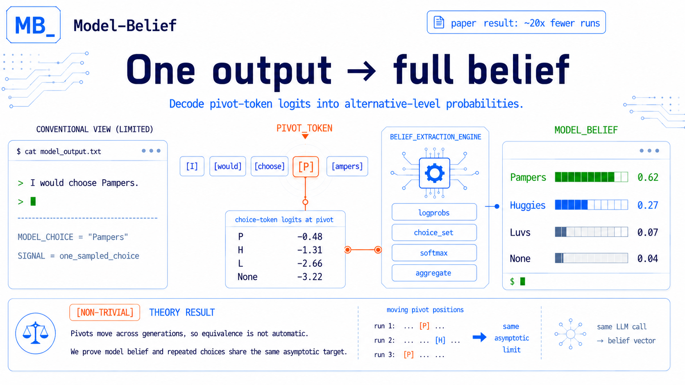

# Model-Belief  
**Token-Level Belief Extraction for Language Models**

<p align="center">
  
</p>

Model-Belief is a lightweight Python library for extracting 
**belief distributions** from large language models (LLMs) with respect to a predefined *alternative set*. 
It operationalizes the idea that an LLM’s decision is revealed at a **specific token position**—the *pivot token*—and 
that the model’s uncertainty can be quantified via token-level logits.

This library operationalizes the concept of model belief introduced in:   

> **From Model Choice to Model Belief: Establishing a New Measure for LLM-Based Research**

The key idea is simple:
> **An LLM’s final choice is only one draw from an internal probability distribution.**  
> **Model belief extracts that distribution directly from token-level logits in a single run.**  

---

## Conceptual Overview

Model-Belief aligns each paper concept with a concrete, inspectable component in the codebase. Below, each concept is briefly explained and mapped to its implementation.

**Choice Set.** A user-defined list of alternatives that defines the decision space for belief extraction. Implemented as choice-map configs listing alternatives and target tokens (`configs/choice_maps/*.yaml`), then compiled into runtime structures (`src/model_belief/config/derive.py`).

**Alternative.** A single option (e.g., a brand) with a label and user-specified target tokens that can realize that choice in text. Tokens must be unique across alternatives (no overlaps), so each token maps to exactly one option. Defined under `choice_set.alternatives` (`configs/choice_maps/*.yaml`).

**Token Universe.** The normalized set of all target tokens across alternatives; belief is computed only over this universe. Constructed during config derivation (`src/model_belief/config/derive.py`).

**Pivot Token (Decision Point).** The token (or short token series) whose realization uniquely determines the alternative. The project offers three ways to identify it: (1) rule-based “first available” with optional anchors, (2) an LLM-based judge, or (3) a user-defined custom function. Implemented under `src/model_belief/pivot/*`.

**Model Belief.** The probability distribution over alternatives inferred from token-level probabilities at the pivot position, computed by softmaxing pivot logits over the token universe and aggregating by alternative (`src/model_belief/belief/belief.py`).

**Logprob Extraction.** The request for model output plus token-level log probabilities required for belief computation, implemented in the generation wrapper and configured per provider (`src/model_belief/llm/generate.py`, `configs/models.yaml`).


## Installation

Requires Python 3.10+.

Install from a local checkout:

```bash
pip install -e .
```

## Usage

### Pipeline Overview

1. **Define inputs in YAML.** Configure `configs/models.yaml` for provider + logprobs, and `configs/choice_maps/*.yaml` for the choice set, token policy, and pivot strategy.
2. **Run the core steps.** Generate with logprobs → detect pivot → compute belief.

### Key Inputs (YAML)

**`configs/models.yaml`**
- `openai.response.*`: used only when you call the LLM to generate a response with logprobs.
- `openai.response.logprobs`: set to `true` to request token-level logprobs.
- `openai.response.top_logprobs`: number of the top tokens to return logprobs for, should be between 1 - 20.
- `openai.pivot_judge.*`: used only when `pivot.active = llm_judge` to have an LLM judge the pivot token.

**`configs/choice_maps/*.yaml`**
- `choice_set.alternatives`: define options + `target_tokens`.
- `token_policy`: case sensitivity and leading-space variants.
- `pivot.active`: `first_token_available`, `llm_judge`, or `custom`.

### Key Functions

- `generate_with_logprobs(models_yaml_path=..., input=...)`  
  Call the large language model and return text plus token-level logprobs needed for belief extraction.  
  Input: provider config path and a list of chat messages.  
  Output: generated text plus token-level logprobs (`text`, `logprobs_content`).
- `get_pivot_finder(choice_map)`  
  Choose the pivot-identification strategy based on `pivot.active`.  
  Input: a derived choice map with `pivot.active` set.  
  Output: a pivot-finder callable configured for the chosen strategy.
- `resolve_pivot(finder, logprobs_content, choice_map, ctx)`  
  Find the pivot position using the pivot-indentification strategy. 
  Input: pivot finder, token logprobs, choice map, and context (e.g., output text, metadata).  
  Output: `PivotResult` with `pivot_index`, `pivot_token`, and `pivot_choice`.
- `compute_belief(logprobs_content, pivot_index, choice_map)`  
  Compute the belief distribution at the pivot token over the alternatives.  
  Input: token logprobs, the pivot index, and the choice map.  
  Output: belief distribution over alternatives (probabilities that sum to 1).

### Example: End-to-End (Generate → Pivot → Belief)

The script `examples/e2e.py` runs the full pipeline end-to-end. It loads the YAML configs, prompts the model, collects token-level logprobs, identifies the pivot token using the configured strategy, and computes the belief distribution at that pivot. It prints the raw model output, pivot details, and belief scores.

```bash
# set your OpenAI API key before running the example
export OPENAI_API_KEY="..."   
python examples/e2e.py
```

### Example: Pivot + Belief From Existing Logprobs

This example skips generation and instead consumes an existing response + logprobs payload, then runs pivot detection and belief extraction only.

```bash
python examples/pivot_from_logprobs.py
```


